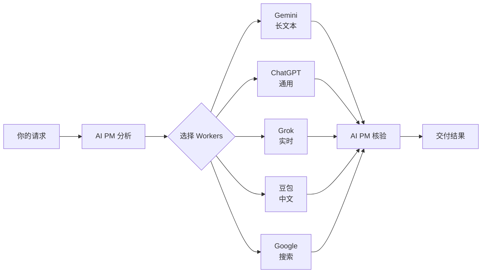

<div align="center">


# Relay

### 🚀 Stop copying prompts. Start orchestrating AI.

**Your AI doesn't need to do everything. It needs to manage everything.**

[](LICENSE)
[](https://github.com/AIPMAndy/Relay/stargazers)
[](https://codex.com)
[](https://claude.ai/code)

[English](#english) | [中文](#中文)

---

</div>

## 中文

### 💡 核心理念

你花了 $300 买 AI 课程，学到的是"用这个神奇 prompt"。

**Relay 教你的是**：让 Claude/Codex 当项目经理，调度 Gemini 读长文、ChatGPT 写代码、Grok 查实时信息、豆包润色中文——然后自己核验结果、解决冲突、交付答案。

就像真实团队：**经理不写所有代码，但对最终质量负责。**

---

### ⚡ 30 秒演示

**传统方式**：
```
你：帮我分析这份 50 页的 PDF 报告
AI：[耗尽上下文] [数据可能过时] [单一视角]
```

**Relay 方式**：
```
你：用 /relay 让 Gemini 读这份报告（它有 200K 上下文），
    Google Search 核对里面的数据，你综合后给我要点

AI PM (Claude)：
  ✓ 把 PDF 分配给 Gemini → 提取核心论点和数据
  ✓ 把关键声明交给 Google Search → 找最新来源
  ✓ 对比两个结果 → 标记过时信息
  ✓ 综合核验 → 给你 3 页可信总结 + 来源链接
```

**结果**：
- ✅ 主 AI 上下文没爆
- ✅ 数据已核验（不是瞎编）
- ✅ 多模型优势互补
- ✅ 你只看最终报告

---

### 🎯 适合什么场景？

<table>
<tr>
<td width="50%">

#### ❌ 不需要 Relay
- 一句话问答
- 简单代码补全
- 本地文件操作
- 隐私敏感任务

</td>
<td width="50%">

#### ✅ 完美适配 Relay
- 📄 长文档分析（交给 Gemini）
- 🔍 事实核查（Google Search + 交叉验证）
- 🇨🇳 中文内容（豆包润色 + Claude 审核）
- 🎨 多模态任务（图片 + 文字）
- 🤔 需要第二意见（独立审查）
- ⏱️ 省上下文（子任务外包）

</td>
</tr>
</table>

---

### 🚀 5 分钟上手

#### 安装

```bash
git clone https://github.com/AIPMAndy/Relay.git
cd Relay
./install.sh
```

安装脚本自动检测你的环境（Codex 或 Claude Code）并配置好一切。

#### 第一个任务

**Codex**:
```
用 $relay 调度 Gemini 总结这篇文章的核心观点，
Google Search 验证里面的统计数据，你给我最终报告
```

**Claude Code**:
```
用 /relay 让豆包把这段英文改写成适合中国用户的版本，
你检查技术准确性后给我定稿
```

#### 工作原理



---

### 🔥 真实案例

<details>
<summary><b>案例 1：研究报告 + 事实核验</b></summary>

**任务**：分析竞品定价策略

```
/relay 让 Google Search 找到三家竞品的官方定价页面，
Gemini 提取价格表和特性对比，你验证数据并给我分析报告
```

**Relay 执行**：
1. Google Search → 找到官方页面
2. Gemini → 提取结构化数据
3. Claude 核验 → 打开原始链接确认价格
4. 输出 → Markdown 表格 + 定价策略分析

**节省**：30 分钟手动搜索 + 避免数据错误
</details>

<details>
<summary><b>案例 2：中文内容本地化</b></summary>

**任务**：英文技术文章改写为中文

```
/relay 把这篇 Kubernetes 文章交给豆包改写成中国开发者习惯的表达，
你检查技术术语准确性并补充本地化案例
```

**Relay 执行**：
1. 豆包 → 中文改写 + 文化本地化
2. Claude 核验 → 检查技术概念是否走样
3. Claude 补充 → 添加阿里云/腾讯云案例
4. 输出 → 地道中文版 + 技术准确

**优势**：豆包的中文 + Claude 的技术把关
</details>

<details>
<summary><b>案例 3：多模型代码审查</b></summary>

**任务**：安全 + 性能双重审查

```
/relay 让 ChatGPT 做安全审查，Gemini 做性能分析，
你解决冲突建议并给我优先级排序的改进清单
```

**Relay 执行**：
1. ChatGPT → 识别 SQL 注入、XSS 风险
2. Gemini → 发现 O(n²) 算法、内存泄漏
3. Claude 综合 → 解决"安全修复 vs 性能优化"的冲突
4. 输出 → 按严重程度排序的 TODO 列表

**价值**：独立视角 + 智能冲突解决
</details>

---

### 🎨 支持的 AI Workers

| Provider | 擅长领域 | 典型任务 |
|----------|---------|---------|
| 🔍 **Google Search** | 来源发现、事实核查 | 找官方文档、验证数据 |
| 💎 **Gemini** | 长文档、多模态、Google 生态 | 200 页 PDF 分析、视频理解 |
| 💬 **ChatGPT** | 通用综合、代码、结构化分析 | 代码审查、方案设计 |
| 🚀 **Grok** | 实时信息、X 平台内容 | 最新新闻、推文分析 |
| 🇨🇳 **豆包 (Doubao)** | 中文创作、本地化 | 中文润色、文化适配 |

**未来支持**：Perplexity、Claude Web（如果开放 API）、DeepSeek 等

---

### ⚠️ 核心安全承诺

#### 1. 人类节奏操作（防封号）

Relay **强制执行**人类操作节奏，不是建议，是硬性规则：

```typescript
✅ 所有操作间隔 ≥ 500ms
✅ 页面导航后等待 1.5-2.5 秒
✅ 长文本分段输入，段间 300-800ms
✅ 响应轮询 ≥ 5 秒间隔
❌ 禁止机械式批量操作
```

详见：[HUMAN_PACING.md](HUMAN_PACING.md)（使用前必读）

#### 2. 隐私边界

- ❌ 绝不发送密码、API Key、支付信息
- ❌ 绝不让 Worker 发布、删除、修改账号
- ✅ 登录/验证码永远交还用户控制
- ✅ 所有 Worker 输出都经 AI PM 核验

#### 3. 环境自动检测

```javascript
if (claude_code) {
  use_webbridge();  // Kimi WebBridge MCP
} else if (codex) {
  use_cdp_browser(); // CDP / in-app Browser
}
// 用户无需配置，自动适配
```

---

### 🛠️ 技术架构

```
┌─────────────────────────────────────────┐
│         AI PM (Claude / Codex)          │  ← 唯一负责人
│  ✓ 任务拆解  ✓ Worker 选择  ✓ 结果核验  │
└─────────────────┬───────────────────────┘
                  │
        ┌─────────┴─────────┐
        │  Browser Adapter   │  ← 环境检测 + 安全层
        │  (人类节奏强制)     │
        └─────────┬─────────┘
                  │
      ┌───────────┼───────────┐
      │           │           │
   Codex      Claude Code   Future
   CDP          WebBridge    Playwright
```

**特性**：
- ✅ 零配置环境检测
- ✅ 代码级安全约束（不是文档建议）
- ✅ 模块化 Provider 配置
- ✅ TypeScript + Python 双语言支持

---

### 📖 完整文档

- 📘 [快速开始](QUICKSTART.md) - 5 分钟入门
- 📕 [使用案例](EXAMPLES.md) - 10+ 真实场景
- 📗 [人类节奏规范](HUMAN_PACING.md) - ⚠️ 账号安全必读
- 📙 [浏览器操作手册](skills/relay/references/browser-runbook.md)
- 📓 [Provider 选择矩阵](skills/relay/references/provider-routing.md)

---

### 🤝 贡献指南

欢迎贡献！特别需要：

1. **新 Provider 适配** - Perplexity、DeepSeek、Claude Web
2. **选择器更新** - AI 平台 UI 经常变化
3. **案例分享** - 你的真实使用场景
4. **Bug 修复** - 特别是边缘情况

提交 PR 前请确保：
- ✅ 遵守 [HUMAN_PACING.md](HUMAN_PACING.md) 时间标准
- ✅ 添加测试和文档
- ✅ 代码通过 linter

---

### 💬 社区与支持

- 🐛 [报告 Bug](https://github.com/AIPMAndy/Relay/issues/new?template=bug_report.md)
- 💡 [功能建议](https://github.com/AIPMAndy/Relay/issues/new?template=feature_request.md)
- 💬 [Discussions](https://github.com/AIPMAndy/Relay/discussions)
- 🐦 Twitter: [@AIPMAndy](https://twitter.com/AIPMAndy)

---

### 📊 项目状态

- ✅ 双环境支持（Codex + Claude Code）
- ✅ 5 个主流 Provider 配置
- ✅ 强制安全机制
- 🚧 更多 Provider 适配中
- 🚧 Web UI 规划中
- 🚧 VS Code 扩展计划中

---

### 📜 开源协议

[MIT License](LICENSE) - 自由使用、修改、商用

**Created by** [@AIPMAndy](https://github.com/AIPMAndy)

---

### ⭐ Star History

如果 Relay 帮到了你，请给个 Star！这对开源项目很重要。

[](https://star-history.com/#AIPMAndy/Relay&Date)

---

</div>

## English

### 💡 Core Philosophy

You paid $300 for an AI course. What did you learn? "Use this magic prompt."

**Relay teaches you**: Make Claude/Codex the project manager. It delegates reading to Gemini, coding to ChatGPT, real-time search to Grok, Chinese polishing to Doubao — then verifies results, resolves conflicts, and delivers the final answer.

Like a real team: **The manager doesn't write all the code, but owns the final quality.**

---

### ⚡ 30-Second Demo

**Traditional Way**:
```
You: Analyze this 50-page PDF report
AI: [context overflow] [possibly outdated data] [single perspective]
```

**Relay Way**:
```
You: Use /relay to have Gemini read this report (200K context),
     Google Search verify the data, then synthesize the key points

AI PM (Claude):
  ✓ Assigns PDF to Gemini → extracts core arguments and data
  ✓ Sends key claims to Google Search → finds latest sources
  ✓ Compares results → flags outdated information
  ✓ Synthesizes and verifies → delivers 3-page summary + source links
```

**Result**:
- ✅ Main AI context preserved
- ✅ Data verified (not hallucinated)
- ✅ Multi-model strengths combined
- ✅ You only see the final report

---

### 🎯 When to Use Relay?

<table>
<tr>
<td width="50%">

#### ❌ Don't Need Relay
- One-sentence Q&A
- Simple code completion
- Local file operations
- Privacy-sensitive tasks

</td>
<td width="50%">

#### ✅ Perfect for Relay
- 📄 Long document analysis (→ Gemini)
- 🔍 Fact-checking (Google + cross-verification)
- 🇨🇳 Chinese content (Doubao + Claude review)
- 🎨 Multimodal tasks (image + text)
- 🤔 Second opinion (independent review)
- ⏱️ Save context (outsource subtasks)

</td>
</tr>
</table>

---

### 🚀 5-Minute Quickstart

#### Installation

```bash
git clone https://github.com/AIPMAndy/Relay.git
cd Relay
./install.sh
```

The installer auto-detects your environment (Codex or Claude Code) and sets everything up.

#### First Task

**Codex**:
```
Use $relay to have Gemini summarize this article's core arguments,
Google Search verify the statistics, then give me the final report
```

**Claude Code**:
```
Use /relay to have Doubao rewrite this English text for Chinese users,
then you check technical accuracy and give me the final version
```

---

### 🔥 Real-World Examples

**Research + Fact-Checking**:
```
/relay: Google Search finds 3 competitors' pricing pages,
Gemini extracts pricing tables, you verify and analyze
```

**Chinese Localization**:
```
/relay: Doubao rewrites this Kubernetes article for Chinese developers,
you ensure technical terms are accurate
```

**Multi-Model Code Review**:
```
/relay: ChatGPT does security audit, Gemini does performance analysis,
you resolve conflicts and prioritize fixes
```

See [EXAMPLES.md](EXAMPLES.md) for 10+ detailed use cases.

---

### ⚠️ Core Safety Guarantees

#### 1. Human-Paced Operations (Anti-Ban)

Relay **enforces** human timing patterns. Not a suggestion — a hard requirement:

```typescript
✅ All operations ≥ 500ms apart
✅ Navigation waits 1.5-2.5 seconds
✅ Long text chunked with 300-800ms delays
✅ Response polling ≥ 5-second intervals
❌ NO mechanical batch operations
```

See [HUMAN_PACING.md](HUMAN_PACING.md) (mandatory reading)

#### 2. Privacy Boundaries

- ❌ Never sends passwords, API keys, payment data
- ❌ Never lets workers publish, delete, or modify accounts
- ✅ Login/CAPTCHA always returned to user control
- ✅ All worker outputs verified by AI PM

---

### 🛠️ Technical Architecture

```
┌─────────────────────────────────────────┐
│       AI PM (Claude / Codex)            │  ← Single point of accountability
│  ✓ Task decomposition  ✓ Worker routing │
│  ✓ Result verification ✓ Conflict resolution │
└─────────────────┬───────────────────────┘
                  │
        ┌─────────┴─────────┐
        │  Browser Adapter   │  ← Environment detection + safety layer
        │  (enforced timing)  │
        └─────────┬─────────┘
                  │
      ┌───────────┼───────────┐
      │           │           │
   Codex      Claude Code   Future
   CDP          WebBridge    Playwright
```

---

### 📖 Full Documentation

- 📘 [Quick Start](QUICKSTART.md)
- 📕 [Examples](EXAMPLES.md)
- 📗 [Human Pacing](HUMAN_PACING.md) - ⚠️ Account safety
- 📙 [Browser Runbook](skills/relay/references/browser-runbook.md)
- 📓 [Provider Routing](skills/relay/references/provider-routing.md)

---

### 🤝 Contributing

Contributions welcome! Especially need:

1. **New Provider Adapters** - Perplexity, DeepSeek, Claude Web
2. **Selector Updates** - AI platform UIs change frequently
3. **Use Case Sharing** - Your real-world scenarios
4. **Bug Fixes** - Edge cases especially

Before submitting PR:
- ✅ Follow [HUMAN_PACING.md](HUMAN_PACING.md) timing standards
- ✅ Add tests and documentation
- ✅ Pass linter

---

### 📜 License

[MIT License](LICENSE) - Free to use, modify, and commercialize

**Created by** [@AIPMAndy](https://github.com/AIPMAndy)

---

### ⭐ If Relay Helped You...

Please give it a star! It matters a lot for open-source projects.

[](https://github.com/AIPMAndy/Relay/stargazers)

---

<div align="center">

**[🔝 Back to Top](#relay)**

Made with ❤️ by the AI orchestration community

</div>
